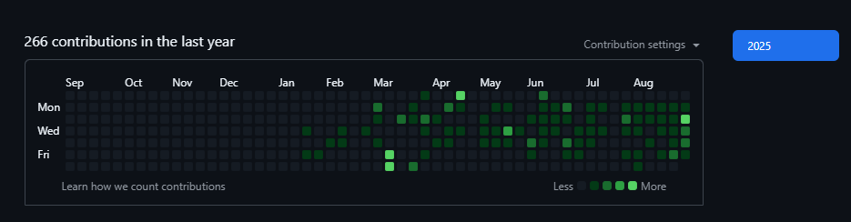

@ -1,55 +1,237 @@
<h1 align="left">Hey, I'm Igor Nunes 👋</h1>

---

<h3 align="left">About Me</h3>

I’m 21 years old and based in Brazil. I am a Full Stack Developer with experience in PHP, jQuery, and MySQL. Currently, I work in technical support, which gives me direct contact with users and production systems, helping me strengthen my problem-solving, communication, and software maintenance skills.

---

<h3 align="left">📫 Contact Me</h3>

  

---

<h3 align="left">💻 Programming Languages & Technologies</h3>

  
  
  
  
  
  
  
  
  

---

<h3 align="left">🚀 Projects</h3>

<ul>
  <li>🌐 <a href="https://igornunes.netlify.app/" target="_blank">Igor Nunes Portfolio</a> – My personal portfolio showcasing my projects and skills. <strong>Technologies:</strong> HTML, CSS, JavaScript, PHP.</li>
  <li>☁️ <a href="https://cloudytempo.netlify.app/" target="_blank">CloudyTempo</a> – A weather app displaying current conditions and forecasts. <strong>Technologies:</strong> HTML, CSS, JavaScript, Weather API.</li>
  <li>⏱️ <a href="https://chronopulsetimer.netlify.app/" target="_blank">ChronoPulse Timer</a> – A timer application designed to track activities accurately. <strong>Technologies:</strong> HTML, CSS, JavaScript.</li>
  <li>⛪ <a href="http://igreja.byethost4.com/?i=2" target="_blank">Church Project</a> – A website developed for a church, demonstrating my experience in PHP, Bootstrap, and web development. <strong>Technologies:</strong> PHP, HTML, CSS, Bootstrap.</li>
</ul>

<!-- <h3 align="left">📊 GitHub Contributions</h3>

  <!--  -->

 -->

<!DOCTYPE html>
<html lang="pt-br">
<head>
  <meta charset="UTF-8" />
  <meta name="viewport" content="width=device-width, initial-scale=1.0" />
  <title>Igor Nunes — Portfolio README</title>
  <link rel="preconnect" href="https://fonts.googleapis.com">
  <link rel="preconnect" href="https://fonts.gstatic.com" crossorigin>
  <link href="https://fonts.googleapis.com/css2?family=Inter:wght@400;500;600;700;800&display=swap" rel="stylesheet">
  <link rel="icon" href="data:image/svg+xml,%3Csvg xmlns='http://www.w3.org/2000/svg' viewBox='0 0 100 100'%3E%3Ccircle cx='50' cy='50' r='48' fill='%2300D1B2'/%3E%3Ctext x='50' y='58' font-size='52' text-anchor='middle' fill='white' font-family='Verdana'%3EI%3C/text%3E%3C/svg%3E">
  
</head>
<body>
  

    <!-- HERO -->
    <header class="hero">
      <h1 class="title">Hey, I'm Igor Nunes 👋</h1>
      
21 anos • Brasil • Desenvolvedor Full Stack (PHP • jQuery • MySQL) • atualmente em Suporte Técnico — foco em <strong>resolução de problemas</strong>, <strong>comunicação</strong> e <strong>manutenção de software</strong>.

      

        <a class="btn btn-primary" href="mailto:Igornunes2j@gmail.com" aria-label="Enviar email">📫 Fale comigo</a>
        <a class="btn" href="#projects">🚀 Ver projetos</a>
      

    </header>

    <!-- ABOUT -->
    <section class="section" id="about">
      <h2>Sobre mim</h2>
      
Sou desenvolvedor focado em <strong>stack web</strong> e tenho experiência prática com <strong>PHP</strong>, <strong>jQuery</strong>, <strong>MySQL</strong> e <strong>Bootstrap</strong>. No dia a dia do suporte técnico, tenho contato direto com usuários e sistemas em produção, o que fortalece minha visão de <em>produto</em> e meu cuidado com <em>qualidade</em>, <em>estabilidade</em> e <em>DX</em> (developer experience).

    </section>

    <!-- CONTACT -->
    <section class="section" id="contact">
      <h2>Contato</h2>
      

        <a class="btn" href="mailto:Igornunes2j@gmail.com">📧 Igornunes2j@gmail.com</a>
      

    </section>

    <!-- TECH -->
    <section class="section" id="tech">
      <h2>💻 Tecnologias</h2>
      

        

          
          PHP
        

        

          
          jQuery
        

        

          
          JavaScript
        

        

          
          MySQL
        

        

          
          Bootstrap
        

      

    </section>

    <!-- PROJECTS -->
    <section class="section" id="projects">
      <h2>🚀 Projetos</h2>
      

        <article class="card float">
          <h3>Portfolio – Igor Nunes</h3>
          
Meu portfólio com projetos e habilidades.

          

            HTML
            CSS
            JavaScript
            PHP
          

          
        </article>

        <article class="card">
          <h3>CloudyTempo</h3>
          
App de clima com condições atuais e previsão.

          

            HTML
            CSS
            JavaScript
            Weather API
          

          
        </article>

        <article class="card">
          <h3>ChronoPulse Timer</h3>
          
Timer para acompanhar atividades com precisão.

          

            HTML
            CSS
            JavaScript
          

          
        </article>

        <article class="card">
          <h3>Church Project</h3>
          
Website para igreja, destacando experiência em PHP e Bootstrap.

          

            PHP
            HTML
            CSS
            Bootstrap
          

          
        </article>
      

      
Mais detalhes em <a class="underlink" href="https://igornunes.netlify.app/" target="_blank" rel="noreferrer">igornunes.netlify.app</a>

    </section>

    <footer>
      
©  Igor Nunes — feito com HTML + CSS • tema escuro minimalista

    </footer>
  

  
</body>
</html>